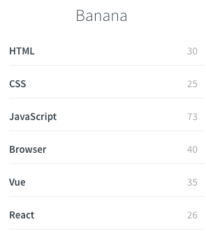

# docsify 折叠 sidebar 插件

## 介绍

    - docsify-sidebar插件，可以在docsify里面折叠sidebar菜单，方便你查看大量页面的时候，只展开一个菜单而不用看到所有的页面。

    - 会计算折叠的数量并在菜单右侧展示折叠的数量。

<center></center>

## 使用

- 引入 js

```html
<script src="https://unpkg.com/@banana_zrl/docsify-sidebar-collapse@0.0.1/dist/docsify-sidebar-collapse-min.js"></script>
```

## 参考链接

[WindrunnerMax 的博客](https://blog.touchczy.top)
参考这个博客里面仓库的 index.html，发现这个插件没有发布，重写一个发布的
